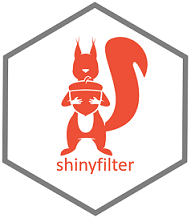
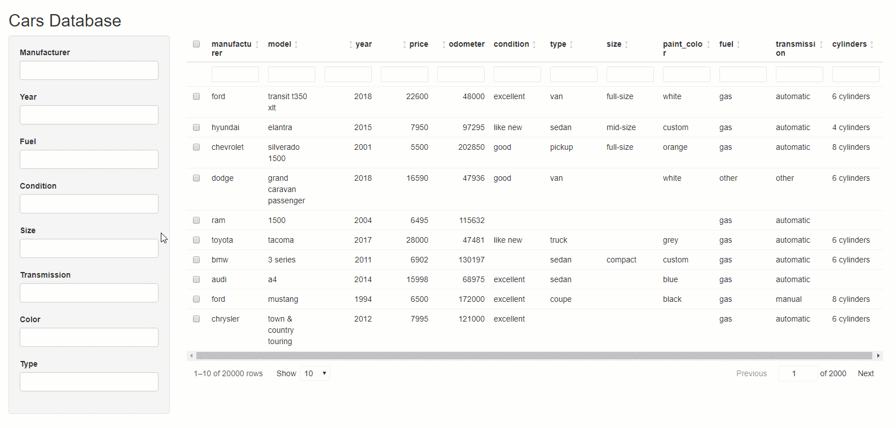

Package shinyfilter
================



## What *shinyfilter* does

With `shinyfilter` you can link `selectizeInput` widgets to a
[`reactable`](https://glin.github.io/reactable/) table and use them as
filters for the columns of that table. All filters are interdependent:
When you change the selection in one filter not only is the table
updated, of course, but also will the available filter values in the
other filters adjust to the new data selection; each filter will only
show those values that are available given the current selection defined
by all the filters together. This mimics the behavior of column filters
in spreadsheet applications like Microsoft *Excel* or LibreOffice
*Calc*.

## How you install *shinyfilter*

Execute `install.packages("shinyfilter", dependencies = TRUE)` in the R
console to install the package including all packages it depends on.

## How you work with *shinyfilter*

### Cookbook recipe for the impatient

In your user interface:

-   add the `selectizeInput` widgets that will serve as filters for the
    `reactable` table; make sure they all have their `onChange` property
    set to the same input variable
-   add the `reactable` table to present your data
-   if you want to use tooltips or popovers to show the currently
    (un)available filter options (given the current filter selection in
    all filters together), call `use_tooltips()` (and change the
    appearance of the tooltips or popovers, if you like)

In your server function:

-   call `define_filters()` to configure which `selectizeInput` widget
    will filter which column of your table
-   handle the `onChange` event of the `selectizeInput` widgets with
    `observeEvent()`:
    -   call `update_filters()` to update the filter values;
        `update_filters()` will return the ‘new’, filtered dataframe.
        Ideally, this is captured in a reactive value so that the
        `reactable` updates automatically
    -   if you want to work with tooltips or popovers, call
        `update_tooltips()`

### Comprehensive tutorial

There is a couple of simple steps to run through when you use
`shinyfilters`. In the following, the process is shown using an example
with `cars`, a subset of the used cars dataset by [Austin
Reese](https://github.com/AustinReese/UsedVehicleSearch). This is also
the example used in the online help for `shinyfilter`. Let us start with
the UI.

##### User interface

1.  Create your UI as usual and place the `reactable` widget and the
    `selectizeInput` widgets for the filters on it. Make sure the
    `selectizeInput` widgets all have an event handler function for the
    `onChange` event (which is triggered everytime the selection in that
    widget changes). All your `selectizeInput` widgets should use the
    *same* event handler for the `onChange` event. To set up such an
    event binding easily you can use `shinyfilter`’s `event()` function
    which produces the required JavaScript code for you. The argument of
    `event()` is the name of the input value that you can process in the
    server function of your application using `observeEvent()` (more on
    that further down below).

    In our example, two filter widgets could then look like this:

    ``` r
    selectizeInput(inputId = "sel_manufacturer", label = "Manufacturer",
                   multiple = TRUE, options = list(onChange = event("ev_click")),
                   choices = sort(unique(cars$manufacturer)))

    selectizeInput(inputId = "sel_fuel", label = "Fuel",
                   multiple = TRUE, options = list(onChange = event("ev_click")),
                   choices = sort(unique(cars$fuel))),
    ```

2.  If you want to use tooltips or popovers to show the user of your
    application the filter options that are currently not available
    (i.e. hidden) because they do not occur in the current selection
    that is shown in the `reactable` then you need to call
    `use_tooltips()` from the UI. Here you can specify the `background`
    (default: black) and `foreground` (default: white) colors, the
    `textalign`ment (default: left), the `fontsize` (default: 100%) and
    the `opacity` (default: 0.8). A call of `use_tooltips()` could look
    like this:

    ``` r
    use_tooltips(background = "#1B3F8C", foreground = "#FFFFFF")
    ```

This is it. Now your UI is ready for `shinyfilter`. Let’s move on to the
server function.

##### Server

In the server function you need to do three things:

1.  Call `define_filters()` to bind the filters to the columns of the
    dataframe you are presenting in the `reactable`. The arguments of
    `define_filters()` are the following:

    -   the `input` argument provided to the server function of your
        application
    -   the `inputId` of the `reactable`
    -   a named vector of the columns of the dataframe that will be
        filtered; the names of the vector elements are the `inputId`s of
        the `selectizeInput` widgets that represent the filters
    -   the dataframe shown in the reactable

    A call of `define_filters()` in our example could look this
    (assuming, the dataframe which is presented in the reactable is
    called `cars` and the `reactable` itself is named `tbl_cars`):

    ``` r
    define_filters(input,
                  "tbl_cars",
                   c(sel_manufacturer = "manufacturer", 
                     sel_fuel = "fuel"),
                   cars)
    ```

2.  An `observeEvent()` call to handle the filter event (`ev_click` in
    our example). In the expression to execute when the event is
    triggered (the `handleExpr` argument of `observeEvent()`) you need
    to call `update_filters()` with the input and session variables (the
    arguments of the server function), and the `inputId` of the
    `reactable` as arguments. `update_filters()` will return a filtered
    dataframe that can be used to update your `reactable`.

    In our example, the data for the `reactable` is stored in a reactive
    object `r` which had been created with:

    ``` r
    r <- reactiveValues(mycars = cars)
    ```

    The `reactable` is rendered based on this data:

    ``` r
    output$tbl_cars <- renderReactable({
      reactable(data = r$mycars,
                filterable = TRUE,
                rownames = FALSE,
                selection = "multiple",
                showPageSizeOptions = TRUE,
                paginationType = "jump",
                showSortable = TRUE,
                highlight = TRUE,
                resizable = TRUE,
                rowStyle = list(cursor = "pointer"),
                onClick = "select"
      )
    })    
    ```

    To update the `reactable` we only need to assign the return value of
    `update_filters()` to the reactive variable:

    ``` r
    r$mycars <- update_filters(input, session, "tbl_cars")
    ```

    So far, the `observeEvent()` call looks like this:

    ``` r
    observeEvent(input$ev_click, {
      r$mycars <- update_filters(input, session, "tbl_cars")
    })
    ```

3.  If you want to use tooltips or popovers to show the hidden
    (currently not available) filter options then you need an additional
    call of `update_tooltips()` in `observeEvent()`. Here, you can
    specify if you want to show not only the *un*available but the
    available filter options as well (argument `show_avail`), how many
    filter options you want to show at most (arguments `max.avail` and
    `max.nonavail` - default for both is `NULL` which means *all* filter
    values are shown), how the available (`title_avail`) and unavailable
    (`title_unavail`) filter options shall be captioned, and what to
    show if the list of filter values exceeds
    `max.avail`/`max.nonavail`; default for the latter arguments
    (`more.nonavail` and `more.avail`) is `"... (# more)"` where `#` is
    a placeholder for the number of values not shown any more. You can
    provide any text you like and use `#` to show the number of filter
    options not listed in the tooltip/popover.

    If you want to show popovers instead of tooltips you need to set the
    `tooltips` argument of `update_tooltips()` to `FALSE`. In this case
    you can specify an additional `popover_title`.

    In our example, embedded in the `observeEvent()` call, this could
    look like this:

    ``` r
    observeEvent(input$ev_click, {
      r$mycars <- update_filters(input, session, "tbl_cars")
      update_tooltips("tbl_cars", 
                      session, 
                      tooltip = TRUE, 
                      title_avail = "Available is:", 
                      title_nonavail = "Currently not available is:",
                      max_avail = 10,
                      max_nonavail = 10)      
    })
    ```

### Full code of the example application

This is how the application looks like (here, we use some more filters
than just the two from above):

 And here is the
code:

``` r
library(shiny)
library(reactable)
library(shinyfilter)

cars_csv <- system.file("cars.csv", package="shinyfilter")

cars <- read.csv(cars_csv, stringsAsFactors = FALSE, header = TRUE, encoding = "UTF-8")

ui <- fluidPage(
                titlePanel("Cars Database"),
                sidebarLayout(
                  sidebarPanel(
                    width = 2,
                    
                    selectizeInput(inputId = "sel_manufacturer", label = "Manufacturer",
                                   multiple = TRUE, options = list(onChange = event("ev_click")),
                                   choices = sort(unique(cars$manufacturer))),
                    
                    selectizeInput(inputId = "sel_year", label = "Year",
                                   multiple = TRUE, options = list(onChange = event("ev_click")),
                                   choices = sort(unique(cars$year))),
                    
                    selectizeInput(inputId = "sel_fuel", label = "Fuel",
                                   multiple = TRUE, options = list(onChange = event("ev_click")),
                                   choices = sort(unique(cars$fuel))),
                    
                    selectizeInput(inputId = "sel_condition", label = "Condition",
                                   multiple = TRUE, options = list(onChange = event("ev_click")),
                                   choices = sort(unique(cars$condition))),
                    
                    selectizeInput(inputId = "sel_size", label = "Size",
                                   multiple = TRUE, options = list(onChange = event("ev_click")),
                                   choices = sort(unique(cars$size))),
                    
                    selectizeInput(inputId = "sel_transmission", label = "Transmission",
                                   multiple = TRUE, options = list(onChange = event("ev_click")),
                                   choices = sort(unique(cars$transmission))),
                    
                    selectizeInput(inputId = "sel_color", label = "Color",
                                   multiple = TRUE, options = list(onChange = event("ev_click")),
                                   choices = sort(unique(cars$paint_color))),
                    
                    selectizeInput(inputId = "sel_type", label = "Type",
                                   multiple = TRUE, options = list(onChange = event("ev_click")),
                                   choices = sort(unique(cars$type))),
                   use_tooltips(background = "#1B3F8C", foreground = "#FFFFFF")
                  ),
                  mainPanel(
                    reactableOutput(outputId = "tbl_cars")
                  )
                )
)


server <- function(input, output, session) {
  
  r <- reactiveValues(mycars = cars)
  
  define_filters(input,
                 "tbl_cars",
                 c(sel_manufacturer = "manufacturer", 
                   sel_year = "year",
                   sel_fuel = "fuel",
                   sel_condition = "condition",
                   sel_size = "size",
                   sel_transmission = "transmission",
                   sel_color = "paint_color",
                   sel_type = "type"), 
                 cars)
  
  
  observeEvent(input$ev_click, {
    r$mycars <- update_filters(input, session, "tbl_cars")
    update_tooltips("tbl_cars", 
                    session, 
                    tooltip = TRUE, 
                    title_avail = "Available is:", 
                    title_nonavail = "Currently not available is:",
                    popover_title = "My filters",
                    max_avail = 10,
                    max_nonavail = 10)
  })
 

  output$tbl_cars <- renderReactable({
    reactable(data = r$mycars,
              filterable = TRUE,
              rownames = FALSE,
              selection = "multiple",
              showPageSizeOptions = TRUE,
              paginationType = "jump",
              showSortable = TRUE,
              highlight = TRUE,
              resizable = TRUE,
              rowStyle = list(cursor = "pointer"),
              onClick = "select"
    )
  })

}

shinyApp(ui = ui, server = server)
```

## Contact the author

Joachim Zuckarelli

Twitter: \[@jsugarelli\](<https://twitter.com/jsugarelli>)

GitHub:
[https://github.com/jsugarelli/shinyfiler](https://github.com/jsugarelli/shinyfilter)
